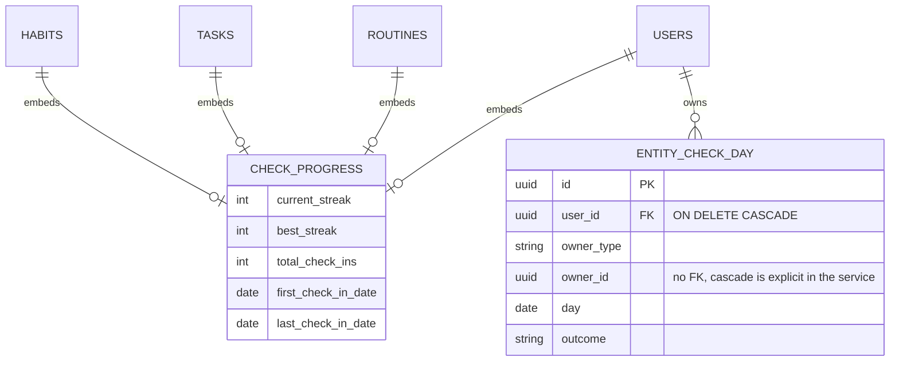
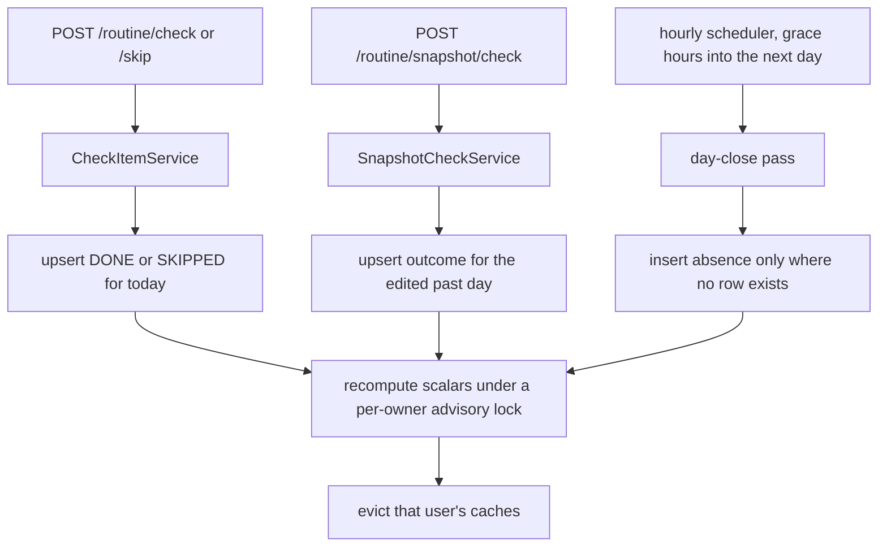
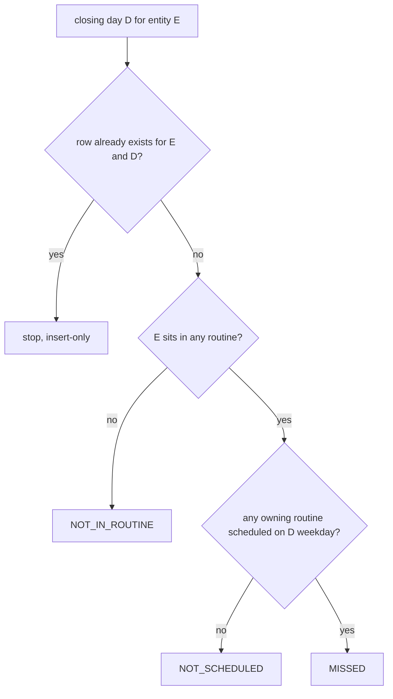
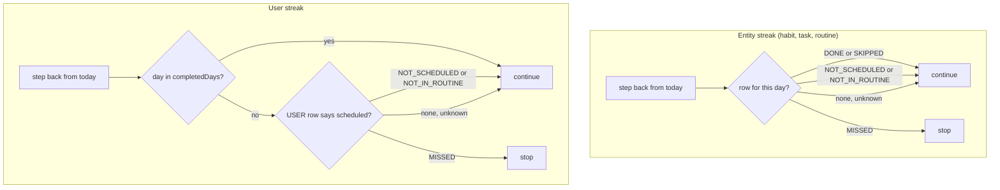

# Entity Check and Streak Metadata - Plan

## Goal Capsule

- **Objective:** Give every checkable entity its own check and streak metadata, plus a permanent per-day outcome history, so habit cards and dashboard widgets render from entity-owned data instead of querying the routine-snapshot tables.
- **Authority hierarchy:** Requirements (R-IDs) win on product behavior. Key Technical Decisions (KTD-IDs) win on implementation mechanism inside their cited requirements. Unit Approach sections override neither.
- **Execution profile:** Sequential. Dependency order is U1 → U2 → U9 → U3 → U4 → U5 → U6 → U7 → U8. U-IDs reflect authoring order, not execution order.
- **Stop conditions:** Stop and surface if the day-close pass cannot be made insert-only against `backfillMissedSnapshots`, or if re-welding the XP bonus to the real streak turns an existing XP assertion red in a way that reveals a second consumer of the lifetime counter.
- **Tail ownership:** Standard repo flow. Branch off `main`, tests green via `./mvnw test`, PR against `main`. The `migration-checks` CI job requires the new `V13__` migration to ship in the same PR as the new `@Embeddable`.
- **Deployment context:** BeYou has no active users and has never deployed to production. Nothing in this plan preserves existing data, existing wire contracts, or existing XP balances, and no decision here is calibrated to an installed base.

---

## Product Contract

### Summary

Add a `CheckProgress` embeddable carrying current streak, best streak, total check-ins, and first/last check-in dates to Habit, Task, Routine, and User. Add an `entity_check_day` side table holding one immutable outcome row per entity per day, retained forever. Three writers keep them current: the live check path, the back-dated snapshot path, and a new day-close pass in the existing per-timezone scheduler. Re-weld the XP streak bonus onto the real streak, rename the misnamed lifetime counter, and fix the server-versus-user timezone bug before any history is written.

### Problem Frame

The habit card wants to show a streak, a record, a check-in count, and a fourteen-day strip. None of that is servable today.

`Habit.constance` looks like a streak and is not one. `CheckItemService.java:379` increments it on check and `CheckItemService.java:285` decrements it on uncheck, with no floor. Nothing resets it on a missed day, so it is a lifetime net check counter that the English interface already labels "Streak". It also feeds `CheckXpCalculator` as the streak bonus, so any habit past fifty check-ins sits permanently at the `STREAK_CAP` of plus fifty percent — meaning the streak bonus has never once rewarded a streak.

Real per-day history exists only in `routine_snapshot` and `snapshot_check`, written by `RoutineSnapshotScheduler` at each timezone's local midnight. That data is unreachable for a habit-centric view: `SnapshotCheckRepository` exposes only `findAllBySnapshotId`, `snapshot_check.original_item_id` has no index, and `SnapshotCheckResponseDTO` does not expose the item id. `DiaryRoutineService.deleteDiaryRoutine` deletes a routine's snapshots in cascade, so deleting a routine erases the history of habits that survive it.

Real streak logic exists only on `User`, where `getCurrentConstance` walks `completedDays` counting consecutive calendar days. It is not schedule-aware, so a Monday/Wednesday/Friday user resets to zero every Tuesday.

Two correctness problems sit underneath. `CheckItemService.checkOrUncheckItemGroup` dates checks in the server zone while the scheduler resolves days in the user's zone, so a user west of the server checking in the evening writes tomorrow's date. And `schedule_days` has no versioning, so whether a routine was scheduled on a past date becomes unknowable the moment the schedule changes.

### Requirements

**Metadata model**

- R1. Habit, recurring Task, Routine, and User each store current streak, best streak, total check-ins, first check-in date, and last check-in date.
- R2. Those scalars are readable without querying `routine_snapshot` or `snapshot_check`.
- R3. The XP streak bonus reads the real current streak, and the lifetime counter is renamed to say what it holds.
- R4. One-time tasks receive no streak metadata.

**Day outcome history**

- R5. Every checkable entity stores one outcome row per day, retained indefinitely.
- R6. Each stored row carries exactly one outcome: done, skipped, missed, not scheduled, or not in a routine.
- R7. An outcome row is never recomputed from a later schedule state.
- R8. History survives routine deletion and routine edits. Deleting the habit or task itself deletes its history.
- R9. History reaches clients through one owner-parameterised range endpoint, never inlined on list endpoints.
- R10. The account data export includes the user's day history, bounded by an explicit range.
- R18. A day with no stored row reads as unknown and neither extends nor breaks a streak.
- R19. The routine-snapshot tables are not read, written, or altered by this feature.

**Streak semantics**

- R11. A day on which the entity was not scheduled does not break its streak.
- R12. A skipped day does not break the streak and does not increment total check-ins.
- R13. Best streak never decreases.
- R14. The user-level streak becomes schedule-aware, replacing the calendar-consecutive rule.
- R20. A streak with no scheduled day for fourteen consecutive days reads as dormant.

**Correctness prerequisites**

- R15. Every date decision in the check and cleanup paths resolves in the owning user's timezone.
- R16. Both check write paths evict the acting user's caches.
- R21. The check response carries the checked entity's updated scalars, so a card needs no refetch.

### Scope Boundaries

- The web and mobile components that render the strips. This plan delivers the API they consume. Two components are waiting: the habit card's fourteen-day strip and the dashboard constance widget, which renders user-level history and currently fakes it.
- The routine-snapshot subsystem. It keeps serving the routine calendar view untouched, per R19.

#### Deferred to Follow-Up Work

- **A retention policy for `entity_check_day`.** R6 stores all five outcomes and R5 retains them forever, which totals roughly thirty-four rows per active user per day. That is a deliberate product choice for a richer strip hover, and it makes a retention or partitioning stance owed before the table is years old. `day` is the natural range-partition key.
- Daily XP delta per category, which the "Melhor área" and "Pior área" widgets need. That is a time series of XP gained, not a check outcome, and nothing stores it today.
- Removing `users.completed_days`. R14 changes how it is interpreted; retiring the column is a later cleanup.
- Habit-level level-up celebrations, which need `RefreshUi.refreshHabit` dispatched into Redux first.

---

## Planning Contract

### Key Technical Decisions

- KTD1. **Metadata is entity-owned, never derived from the snapshot at read time.** (session-settled: user-directed — chosen over read-time snapshot queries: decoupling the card from the snapshot machinery and keeping card reads constant-time)
- KTD2. **Scalars embed on the entity; per-day history lives in a side table.** `SecurityFilter.java:77` loads the full `User` into the security context on every authenticated request, and an `@Embeddable` cannot be lazy. An unbounded per-day structure on `User` or on the cached habit list would be read in full on every request and grow forever.
- KTD3. **A new `CheckProgress` embeddable rather than fields on `XpProgress`.** (session-settled: user-approved — chosen over extending XpProgress: Category is never checked and would carry always-zero columns.) KTD14 accepts a narrower version of that cost for one-time tasks: a subset of rows in `tasks`, not a whole table, and the alternative is splitting the table.
- KTD4. **Full history retained, with no capped window.** (session-settled: user-directed — chosen over a fixed sixty-day rolling window: richer statistics later, and the fourteen-day strip is only the first consumer)
- KTD5. **All four checkable entities land in this batch.** (session-settled: user-directed — chosen over habit-only first: the embeddable pays for itself immediately across entities)
- KTD6. **The XP streak bonus reads the real current streak, with no legacy floor.** (session-settled: user-directed — chosen over freezing the bonus on the lifetime counter, and over a decaying grandfather floor: with no active users there is no balance to protect, and the freeze would have left the celebrated number with no mechanical weight.) `CheckXpCalculator.calculate` keeps its formula and its `STREAK_STEP` / `STREAK_CAP` constants; only its input changes.
- KTD7. **No backfill. History starts when the feature ships.** (session-settled: user-directed — chosen over reconstructing from snapshots: `schedule_days` has no versioning, so a reconstructed "not scheduled" day would be a guess dressed as a fact.) With no installed base this costs nothing.
- KTD8. **No process re-derives an outcome from schedule state.** Operationally this means the day-close pass is insert-only (KTD18), and every reader of "was this day scheduled" reads the frozen row rather than the live schedule. A user editing a past day through the snapshot endpoint is a deliberate correction, not a re-derivation.
- KTD9. **The request path writes presence; the day-close pass writes absence.** Check, uncheck, and skip write the done or skipped row immediately, so today's square is live. The day-close pass only inserts for entities with no row for the closing day. *Rejected alternative:* reading the `snapshot_check` rows `createSnapshotsForUser` just wrote in the same transaction. That would couple the new history to the snapshot lifecycle, which `deleteDiaryRoutine` erases, defeating KTD1 and R8.
- KTD10. **Owner-timezone dates land before any history is written.** (session-settled: user-directed — chosen over accepting the existing off-by-one: permanent rows would store the error forever)
- KTD11. **The user streak reads completion from `completedDays` and scheduling from its own frozen rows.** (session-settled: user-directed — chosen over consulting the live schedule predicate, which would repaint past streaks whenever a routine's schedule changed, and over deriving the whole scalar from rows, which would zero every user at cutover.) This gives the `USER`-owned rows that U5 writes a real consumer, and it is why U6 depends on U5.
- KTD14. **One-time tasks are excluded from metadata.** `TaskCleanupScheduler` deletes them at the midnight after they are checked, and a streak on a thing that happens once carries no meaning.
- KTD16. **Every entity scalar is a pure function of the stored rows, except the user streak.** One recompute derives the count from done rows, the dates from their extremes, the streak from the walk-back, and the record as the running maximum. Incremental counters across three writers is the pattern that produced the unfloored `constance` bug this feature replaces. The user's `currentStreak` and `bestStreak` are the documented exception: they come from the KTD11 walk, because `completedDays` — not the rows — records whether a user's day was complete.
- KTD18. **The day-close pass is insert-only; the request and snapshot paths upsert.** A presence outcome may replace an absence outcome; the reverse never happens. This makes the check-committing-just-after-midnight race harmless and gives KTD8 a one-line test. The pass runs a grace offset into the following day rather than at midnight exactly.
- KTD19. **Absence is read as unknown; nothing writes an unknown row.** A gap beyond the seven-day backfill window can never be resolved honestly. The streak walk treats a missing row as neutral, so scheduler downtime does not read as a broken streak, and a bad write window stays repairable by deleting the affected day range.
- KTD20. **Identity and date travel as parameters, never from the security context.** `CheckItemService.java:481` already documents why: agent tools run on a boundedElastic thread with no `SecurityContext`. Three callers reach the new writes with three different identity sources — the controllers, `Tools.java`, and the scheduler.
- KTD22. **Scheduling is answered by one predicate, extracted from the scheduler.** `RoutineSnapshotScheduler.java:171-181` already computes the weekday and tests schedule membership, and `HabitMapper.toResponseDTO` already walks habit to habit groups to section to routine. U9 extracts the predicate so the day-close pass is not a third implementation. It lives in `domain/routine/schedule`, because it walks routine's internal shape.
- KTD23. **One owner-parameterised read endpoint serves all four owner types.** `GET /check-history` takes owner type, owner id, and a date range. The alternative of a per-resource route matching the repo's controller layout would have shipped a habit reader and left task, routine, and user rows written but unreadable — the dashboard constance widget needs the user rows on day one.
- KTD24. **Deleting a habit or task deletes its history; deleting or editing a routine does not.** R8 exists so a routine edit cannot erase a habit's record, which is the failure `deleteDiaryRoutine` causes today with snapshots. Deleting the habit itself is a deliberate act on an entity the backend already refuses to delete while it sits in a routine, so cascading there matches intent. The snapshot tables are untouched either way, per R19.
- KTD25. **Dormancy is a backend rule with a fourteen-day threshold.** (session-settled: user-directed — chosen over exposing `lastCheckInDate` and letting each client decide: one behavior across web and mobile, at the cost of fixing the threshold server-side.) Fourteen days matches the strip window the first consumer renders.
- KTD26. **The recompute takes a transaction-scoped Postgres advisory lock keyed on owner type and id.** A JVM lock would not survive a second instance and the cost difference is one statement. Acquisition order is user before entity, matching the order `XpCalculatorService` already writes those rows in, so the two cannot deadlock against each other.

### High-Level Technical Design

The data model adds one embeddable and one table.

`owner_id` carries no foreign key, mirroring how `snapshot_check.original_item_id` already stores a bare UUID. Deletion is explicit rather than database-driven, because KTD24 cascades on habit and task deletion but not on routine deletion. `user_id` carries an explicit `ON DELETE CASCADE`, following `fk_feedback_user` in `V9__feedback.sql`; a plain foreign key would block account deletion rather than cascade it.

Three writers keep the model current, and their conflict rule is asymmetric by design.

Presence always wins. The day-close pass never updates a row, so a check that commits just after local midnight is not overwritten by a missed outcome computed moments earlier.

Resolving one day's absence is the branchiest part, and every leaf is reachable at write time.

A done or skipped row never reaches this diagram, because the request path already wrote it.

The two streak walks differ in where they read each half of the question.

Both walks terminate at the earliest day the owner has evidence for — the earliest stored row for an entity, the earliest completed day for a user — so an all-neutral history cannot loop.

---

## System-Wide Impact

**Silent-break surfaces.** Each appears in the file list of the unit named.

| Surface | Risk | Owned by |
|---|---|---|
| `RefreshUiDtoBuilder.java:53,71` | Calls `getCurrentConstance`. Compiles after R14 and returns the new meaning with no signal. | U6 |
| `UserMapper.java:34,44` | Same method plus two server-zone `LocalDate.now()` calls feeding the login response the E2E reads. | U1, U6 |
| `UserService.java:382` | `markDayCompleted` calls `getCurrentConstance(date)` mid-transaction from `CheckItemService`. | U6 |
| `Tools.java:357,365` | Agent check and skip inherit every new write with no `SecurityContext`. | U3 |
| `CheckXpCalculator.java` | R3 changes its input from the lifetime counter to the real streak; existing XP assertions move. | U3 |
| `SnapshotControllerTest.java:203,228`, `RoutineControllerTest.java:226` | Assert `$.refreshUser.maxConstance` equals 7. | U6 |
| `../Beyou-e2e-tests/tests/routine-checkin.spec.ts:66` | Asserts `constance` equals 1 immediately after a check. R3's rename moves this field. | U7 |

**Caching.** Habit scalars now mutate from a non-request path at local midnight, so eviction must happen from the scheduler thread. `UserCacheEvictService.evictAllUserCaches` also performs a global `routineCache.clear()`, so calling it per user during a midnight timezone batch clears the whole routine cache once per user. U5 splits the service so per-user caches evict inside the loop and `routine` clears once after the batch.

**Write amplification.** One row per habit, recurring task, routine, and user, per user, per day. Twenty habits plus ten tasks plus three routines is roughly thirty-four rows per user per day, about twelve thousand four hundred per user per year. Only done, skipped, and missed carry streak information; the rest exist so the strip hover can say why a day is grey, which R6 accepts deliberately. The retention stance is deferred explicitly rather than left silent.

**Startup.** `backfillMissedSnapshots` is a synchronous `ApplicationReadyEvent` listener over all users. Adding day-close work extends boot linearly with users times entities times seven, bounded by the batched existence query in U5.

**Cross-repo contracts.** `../Beyou-arch-design/api/habit/openapi.yaml` and `api/task/openapi.yaml` document the API. The new endpoint, the new response fields, the renamed counter, and the enriched check response all need entries.

**Rate limiting.** `GET /check-history` falls into the generic authenticated-GET tier at `RateLimitFilter.java:122` automatically. Because absent days are returned as unknown rather than omitted, response size tracks the requested range rather than stored rows, so U7's range cap is the real bound.

---

## Risks and Dependencies

- **Lost update on recompute.** Two writers recomputing the same owner concurrently can persist a stale scalar; no constraint catches it. Mitigated by KTD26's advisory lock and its stated acquisition order.
- **Poisoned transaction.** A unique violation raised inside the day-close transaction aborts the whole transaction in Postgres, so catch-and-continue does not work without savepoints. Mitigated by insert-if-absent as a single statement rather than check-then-act.
- **Migration lock.** Adding a column with a constant default is a catalog change in Postgres 15, not a rewrite, and this migration seeds nothing — so there is no row rewrite to hold the lock open. `users` is still read on every authenticated request, so V13 sets an explicit `lock_timeout` and fails fast rather than queueing behind an open transaction.
- **Null embeddable.** Hibernate returns a null embeddable reference when every mapped column is null, which is why `HabitMapper` already guards `xpProgress`. Every pre-existing dev and e2e row would throw on first read without `NOT NULL DEFAULT 0` and field initializers.
- **XP assertions move.** R3 changes what `CheckXpCalculator` receives, so every existing test asserting a specific XP amount after a check changes value. That is the intended blast radius; a test that does not move is a signal the counter has a second consumer nobody mapped.
- **Export ceiling.** `UserExportService` assembles its payload into one in-memory map inside a read-only transaction. The feedback section is bounded by submission count; day history has no natural ceiling, hence the explicit range in R10.

---

## Implementation Units

### U1. Owner-timezone date resolution

- **Goal:** Every date decision in the check and cleanup paths resolves in the owning user's timezone, so permanent history is never written against a server-zone date.
- **Requirements:** R15
- **Dependencies:** none
- **Files:**
  - `src/main/java/beyou/beyouapp/backend/domain/common/UserDateResolver.java` (new)
  - `src/main/java/beyou/beyouapp/backend/domain/routine/checks/CheckItemService.java`
  - `src/main/java/beyou/beyouapp/backend/domain/routine/specializedRoutines/DiaryRoutineService.java`
  - `src/main/java/beyou/beyouapp/backend/domain/task/TaskCleanupScheduler.java`
  - `src/main/java/beyou/beyouapp/backend/domain/task/TaskService.java`
  - `src/main/java/beyou/beyouapp/backend/user/UserMapper.java`
  - `src/test/java/beyou/beyouapp/backend/unit/common/UserDateResolverUnitTest.java` (new)
  - `src/test/java/beyou/beyouapp/backend/unit/user/UserMapperUnitTest.java` (new)
  - `src/test/java/beyou/beyouapp/backend/unit/routine/checks/CheckItemServiceUnitTest.java`
  - `src/test/java/beyou/beyouapp/backend/unit/task/TaskServiceUnitTest.java`
- **Approach:**
  1. Add a resolver that takes a `User` and returns `LocalDate` in that user's zone, falling back to the system zone when `timezone` is null or unparseable. It takes the user as a parameter and never reads the security context, per KTD20.
  2. Replace the hardcoded `LocalDate.now()` at `CheckItemService.java:47`, the fallback at `:61`, and the `markedToDelete` assignment inside `checkTaskGroup`.
  3. Replace the server-zone `LocalDate.now()` in `DiaryRoutineService.getTodayRoutineScheduled`.
  4. Replace both `LocalDate.now()` calls in `UserMapper.toResponseDTO`, which feed the fields the E2E suite asserts on.
  5. Cover both cleanup filters. `TaskCleanupScheduler` filters by `markedToDelete`, and `TaskService.deleteAllMarked:60` re-filters against `LocalDate.now()`; changing only the scheduler leaves the old behavior in place.
- **Execution note:** This changes existing behavior for users outside the server zone. Write the timezone tests first so the before-and-after is visible in the diff.
- **Patterns to follow:** `SnapshotCheckService.java:130` already resolves `LocalDate.now(ZoneId.of(user.getTimezone()))`. `CheckItemService.increaseUserConstanceIfNeeded` already pulls the `User` off `routine.getUser()` rather than the security context.
- **Test scenarios:**
  - A user in `America/Sao_Paulo` checking at 21:00 local while the server runs at UTC gets a check dated their local day, not the next day.
  - A user whose `timezone` is null falls back to the system zone without throwing.
  - A user whose `timezone` is an unparseable string falls back to the system zone and logs a warning.
  - A one-time task checked by an `America/Los_Angeles` user is not deleted until that user's local day has passed, exercised through `TaskService.deleteAllMarked` rather than only the scheduler.
  - `getTodayRoutineScheduled` returns the routine for the user's local weekday when the server's weekday differs.
  - The login response reports the day-completed flag against the user's local day.
- **Verification:** Existing `CheckItemServiceUnitTest` and `CheckItemServiceSkipUnitTest` stay green, and the new timezone cases fail against the pre-change code.

### U2. CheckProgress embeddable, EntityCheckDay entity, and the V13 migration

- **Goal:** Land the schema for entity-owned scalars and the permanent per-day history.
- **Requirements:** R1, R4, R5, R6, R8
- **Dependencies:** none
- **Files:**
  - `src/main/java/beyou/beyouapp/backend/domain/common/CheckProgress.java` (new)
  - `src/main/java/beyou/beyouapp/backend/domain/checkday/EntityCheckDay.java` (new)
  - `src/main/java/beyou/beyouapp/backend/domain/checkday/CheckDayOutcome.java` (new)
  - `src/main/java/beyou/beyouapp/backend/domain/checkday/CheckDayOwnerType.java` (new)
  - `src/main/java/beyou/beyouapp/backend/domain/checkday/EntityCheckDayRepository.java` (new)
  - `src/main/java/beyou/beyouapp/backend/domain/habit/Habit.java`
  - `src/main/java/beyou/beyouapp/backend/domain/task/Task.java`
  - `src/main/java/beyou/beyouapp/backend/domain/routine/Routine.java`
  - `src/main/java/beyou/beyouapp/backend/user/User.java`
  - `src/main/resources/db/migration/V13__check_progress_and_entity_check_day.sql` (new)
  - `.github/workflows/ci.yml`
  - `src/test/java/beyou/beyouapp/backend/integration/checkday/EntityCheckDayRepositoryIntegrationTest.java` (new)
  - `src/test/java/beyou/beyouapp/backend/integration/schema/SchemaIndexParityTest.java`
- **Approach:**
  1. Write `CheckProgress` with explicit `@Column(name = ...)` on every field, following `domain/feedback/FeedbackContext.java`. Do not follow `XpProgress`, whose bare field names would collide with the existing `habits.constance` and `users.max_constance` columns.
  2. Give the three integer columns `NOT NULL DEFAULT 0` and matching field initializers on all four entities. Hibernate returns a null embeddable when every mapped column is null, so pre-existing dev rows would otherwise throw. Dates stay nullable. The `routines` columns can be non-null because `DiaryRoutine` is the only subclass.
  3. Put `EntityCheckDay` and its enums in their own domain package as a sibling of habit and task, mirroring `domain/feedback/`. Only `CheckProgress` belongs in `domain/common`, beside `XpProgress`.
  4. Model `userId` as a real association and `ownerId` as a bare `UUID` with no foreign key.
  5. Declare the unique constraint on `(owner_type, owner_id, day)` and the `(user_id, day)` index as `@UniqueConstraint(name = ...)` and `@Index` on the entity, so `SchemaIndexParityTest` guards them without touching its hardcoded SQL-only list.
  6. Spell the user foreign key as `ON DELETE CASCADE`, following `fk_feedback_user` in `V9__feedback.sql:38`.
  7. Open the migration with explicit `lock_timeout` and `statement_timeout` settings, and remove `require-timeout-settings` from the squawk exclusion list in `.github/workflows/ci.yml`.
  8. Follow the `V9__feedback.sql` style: `CREATE ... IF NOT EXISTS`, named `pk_`/`fk_`/`*_check` constraints, and a `-- squawk-ignore` comment with a written justification wherever a rule is suppressed.
  9. Add the new table to the delete-ordering javadoc in `UserService.deleteUser`.
- **Patterns to follow:** `V9__feedback.sql` for migration style, constraint naming, and cascade spelling. `snapshot_check` for the no-foreign-key owner reference. `FeedbackContext` for explicit embeddable column naming.
- **Test scenarios:**
  - Inserting two rows with the same owner type, owner id, and day violates the unique constraint.
  - Deleting the owning user succeeds and removes its rows, asserting the delete itself does not fail.
  - Reading a pre-existing habit that predates the migration returns zeroed scalars rather than throwing.
  - A range query by owner and day boundaries returns rows ordered by day and excludes rows outside the range.
  - A range query scoped to a user and day range returns every owner type, which is what the export needs.
  - `SchemaIndexParityTest` passes with the new constraint and index declared on the entity.
  - Every integration test still boots, proving Hibernate `validate` agrees with the migration.
- **Verification:** `./mvnw test` green, and squawk clean on the new migration with the timeout exclusion removed from CI.

### U9. Scheduled-on-day predicate

- **Goal:** One predicate answers whether an owner was scheduled on a given weekday, so no writer re-implements it.
- **Requirements:** R11
- **Dependencies:** none
- **Files:**
  - `src/main/java/beyou/beyouapp/backend/domain/routine/schedule/ScheduledOnDayResolver.java` (new)
  - `src/main/java/beyou/beyouapp/backend/domain/routine/snapshot/RoutineSnapshotScheduler.java`
  - `src/test/java/beyou/beyouapp/backend/unit/routine/schedule/ScheduledOnDayResolverUnitTest.java` (new)
- **Approach:**
  1. Extract the weekday computation and schedule-membership test that `RoutineSnapshotScheduler.java:171-181` already performs, and have the scheduler call the extracted predicate rather than keeping its own copy.
  2. Answer four owner shapes: a habit or task is scheduled on day D when any routine containing it has a schedule covering D's weekday; a routine when its own schedule covers it; a user when any of their routines does.
  3. Place it in `domain/routine/schedule` rather than a shared package. It walks routine's internal shape, so it belongs where that shape is owned.
  4. Do not rely on at-most-one-routine-per-weekday. `ScheduleService.checkAndReplaceScheduledRoutines` only enforces that for schedules written through it, and the rule here is "any owning routine covers the day" regardless.
- **Test scenarios:**
  - A habit in a Monday/Wednesday/Friday routine is scheduled on Wednesday and not on Tuesday.
  - A habit in two routines with disjoint schedules is scheduled on the union of both.
  - A habit in a routine whose schedule is null is not scheduled on any day, and the predicate reports it as in-a-routine.
  - A habit in no routine at all is reported as not-in-a-routine, distinct from the previous case.
  - A user with no routines is not scheduled on any day.
  - The scheduler's existing snapshot behavior is unchanged after the extraction, proven by the existing `RoutineSnapshotSchedulerTest`.
- **Verification:** `RoutineSnapshotSchedulerTest` stays green with no behavioral diff, and the predicate's own cases pass in isolation.

### U3. Live check path writes presence, recomputes scalars, and re-welds XP

- **Goal:** Check, uncheck, and skip write today's outcome row, recompute the owner's scalars, and pay XP against the real streak.
- **Requirements:** R1, R2, R3, R12, R13, R16, R18, R21
- **Dependencies:** U1, U2, U9
- **Files:**
  - `src/main/java/beyou/beyouapp/backend/domain/checkday/CheckDayRecorder.java` (new)
  - `src/main/java/beyou/beyouapp/backend/domain/checkday/CheckProgressCalculator.java` (new)
  - `src/main/java/beyou/beyouapp/backend/domain/routine/checks/CheckItemService.java`
  - `src/main/java/beyou/beyouapp/backend/domain/routine/specializedRoutines/DiaryRoutineService.java`
  - `src/main/java/beyou/beyouapp/backend/domain/common/RefreshUiDtoBuilder.java`
  - `src/main/java/beyou/beyouapp/backend/domain/common/DTO/RefreshObjectDTO.java`
  - `src/main/java/beyou/beyouapp/backend/domain/habit/Habit.java`
  - `src/main/java/beyou/beyouapp/backend/domain/aiAgent/tools/Tools.java`
  - `src/test/java/beyou/beyouapp/backend/unit/checkday/CheckProgressCalculatorUnitTest.java` (new)
  - `src/test/java/beyou/beyouapp/backend/unit/checkday/CheckDayRecorderUnitTest.java` (new)
  - `src/test/java/beyou/beyouapp/backend/unit/routine/checks/CheckItemServiceUnitTest.java`
  - `src/test/java/beyou/beyouapp/backend/domain/aiAgent/ToolsUnitTest.java`
- **Approach:**
  1. Split the seam in two. The recorder upserts one row; the calculator derives every scalar from rows. Both take the owner and the date as parameters and never read the security context, per KTD20.
  2. Derive rather than accumulate, per KTD16. The count is done rows, the dates are their extremes, the streak is the walk-back, and the record is the running maximum.
  3. Walk the streak treating done and skipped as continuing, not-scheduled and not-in-routine as neutral, a missing row as neutral per KTD19 and R18, and missed as terminal. Terminate at the earliest stored row for that owner.
  4. On uncheck, resolve the day back to its absence outcome by reading the frozen row's prior state where one exists, and only where none does fall back to U9's predicate. Never delete the row.
  5. Rename `Habit.constance` to `totalCheckIns` and let the calculator own it. The field stops being incremented by hand.
  6. Change `CheckXpCalculator.calculate`'s third argument from the lifetime counter to the owner's current streak, per R3 and KTD6. The formula and both constants stay as they are.
  7. Take KTD26's advisory lock before the recompute, user before entity.
  8. Add the recomputed scalars to `RefreshObjectDTO` so the check response carries them, per R21.
  9. Skip one-time tasks entirely, per KTD14.
  10. Add `evictAllUserCaches` where missing.
- **Execution note:** The XP re-weld moves every existing assertion about XP amounts. Run the existing check tests first and record their current values, so the new expected values are a deliberate diff rather than a guess.
- **Patterns to follow:** `UserService.markDayCompleted` for the raise-only record rule. `DiaryRoutineService.checkAndUncheckGroup` for where eviction sits relative to the delegate call.
- **Test scenarios:**
  - Checking a habit writes one done row for the owner's local day and increments the total by one.
  - Checking the same habit twice on the same day leaves exactly one row and one increment.
  - Unchecking the only check of the day returns the row to its absence outcome and the total to zero, never below.
  - Skipping writes skipped, leaves the total unchanged, and leaves the current streak unchanged.
  - A streak of five with yesterday not-scheduled and the day before done continues rather than resetting.
  - A gap with no row at all is neutral: a streak spanning a missing day is unbroken.
  - A missed row between two done runs resets the current streak to the length of the later run.
  - The record rises when the current streak passes it and stays put when the current streak later falls.
  - An entity with an all-neutral history terminates the walk rather than looping.
  - A habit with a current streak of zero earns the unmultiplied base XP, and one with a streak of ten earns ten percent more.
  - A habit whose streak breaks earns less on the next check than it did before the break, proving the bonus follows the real streak.
  - The check response carries the habit's updated streak, record, and total.
  - A check issued through the agent tool path succeeds with no `SecurityContext` present.
  - One-time tasks produce no row and no scalar update.
- **Verification:** New unit tests green, and every existing XP assertion updated to its new value with the change visible in the diff.

### U4. Back-dated snapshot path writes and recomputes

- **Goal:** Editing a past day through the snapshot endpoints updates the history and the scalars, so a repaired day repairs the streak.
- **Requirements:** R7, R13, R16, R19
- **Dependencies:** U2, U3
- **Files:**
  - `src/main/java/beyou/beyouapp/backend/domain/routine/snapshot/SnapshotCheckService.java`
  - `src/test/java/beyou/beyouapp/backend/integration/routine/snapshot/SnapshotCheckServiceTest.java`
- **Approach:**
  1. Route the snapshot check, uncheck, and skip paths through U3's recorder, passing the snapshot's date rather than today.
  2. Overwriting a past day is the sanctioned mutation. KTD8 freezes outcomes against recomputation from schedule state, not against a user deliberately correcting a day.
  3. Recompute after the edit, since a repaired day can join two streak segments.
  4. Add the missing `evictAllUserCaches` call. This service mutates habit-visible state today and never evicts.
  5. Leave the snapshot tables themselves untouched, per R19 — this unit adds a second write target, it does not change the first.
- **Test scenarios:**
  - Checking a snapshot item for a past day flips that day from missed to done.
  - Repairing a single missed day between two runs of five joins them into a streak of eleven.
  - The record rises after such a repair and does not fall when the same day is unchecked again.
  - Unchecking a past day returns it to missed and shortens the current streak accordingly.
  - The snapshot row itself is unchanged in shape after the edit, proving no regression in the routine calendar view.
  - The acting user's caches are evicted after a snapshot edit.
- **Verification:** Existing snapshot tests stay green, with new assertions covering the scalar recomputation.

### U5. Day-close pass writes absence

- **Goal:** A daily pass inserts an outcome for every owned entity that has no row for the closing day, so the strip has no unexplained holes.
- **Requirements:** R5, R6, R7, R11, R15
- **Dependencies:** U1, U2, U9, U3
- **Files:**
  - `src/main/java/beyou/beyouapp/backend/domain/checkday/DayCloseService.java` (new)
  - `src/main/java/beyou/beyouapp/backend/domain/routine/snapshot/RoutineSnapshotScheduler.java`
  - `src/main/java/beyou/beyouapp/backend/domain/common/UserCacheEvictService.java`
  - `src/test/java/beyou/beyouapp/backend/unit/checkday/DayCloseServiceUnitTest.java` (new)
  - `src/test/java/beyou/beyouapp/backend/integration/routine/snapshot/RoutineSnapshotSchedulerTest.java`
- **Approach:**
  1. Insert only, never update, per KTD18. A presence row written by U3 or U4 always survives.
  2. Use insert-if-absent against the unique key as a single statement rather than check-then-act. A unique violation raised inside the transaction aborts the whole transaction in Postgres, and the blast radius here is one user's entire day across every entity.
  3. Run per user per date, outside the routine loop. A habit in two routines would otherwise be visited twice.
  4. Add a sibling branch in `processSnapshots` gated on the grace hour, closing the prior day, with its own per-user try/catch modelled on `RoutineSnapshotScheduler.java:123-130`. Do not reuse the midnight-exact block, which cannot express KTD18's grace offset.
  5. Wire it at both call sites through the existing `@Lazy self` proxy so it gets its own transaction. `createSnapshotsForUser` early-returns when the user has no routines, so the day-close call cannot live inside it.
  6. Keep the call inside a per-user try/catch. Outside it, one failure escapes the loop, skips `signalHeartbeat()`, and trips the snapshot-job-dead monitor for a reason that is not the snapshot job.
  7. Fetch existing owner ids for the user and day in one query and diff in memory. Per-entity existence checks would be an N+1 across the whole user base, run seven times per user at every boot.
  8. Never read live `HabitGroupCheck` or `TaskGroupCheck` rows. `SnapshotCheckMigrator` deletes them, so a second pass would see nothing.
  9. Split `UserCacheEvictService` so the batch evicts per-user caches inside the loop and clears the shared `routine` cache once afterward, rather than clearing it once per user.
- **Execution note:** Idempotency is the case that matters. Write the double-run test before the pass itself, and assert it performs no writes on the second run rather than only that scalars are unchanged.
- **Patterns to follow:** `RoutineSnapshotScheduler`'s `@Lazy` self-injection for crossing the Spring proxy, and its per-user try/catch for failure isolation.
- **Test scenarios:**
  - Running the pass twice for the same date performs zero writes on the second run.
  - A done row written by the request path is not overwritten when the pass runs afterward for the same day.
  - A check that commits after the pass has already written missed for that day replaces it with done.
  - A habit in a Monday/Wednesday/Friday routine gets not-scheduled for Tuesday and keeps its streak.
  - A habit in no routine gets not-in-routine and keeps its streak.
  - A habit in a routine whose schedule is null gets not-scheduled rather than missed.
  - A habit scheduled for the day with no check gets missed and its current streak drops to zero.
  - A habit in two routines gets exactly one row for the day.
  - A user-owned row is written for the closing day carrying whether any routine was scheduled.
  - One-time tasks are skipped entirely.
  - A user with no routines produces a user-level not-in-routine row and no exception.
  - A failure closing one user's day does not prevent the heartbeat from firing.
  - `backfillMissedSnapshots` running its seven-day window on boot produces no duplicate rows and no scalar drift.
- **Verification:** `./mvnw test -Dtest=DayCloseServiceUnitTest` green, and `RoutineSnapshotSchedulerTest` still passes with the new step wired in.

### U6. Schedule-aware user streak

- **Goal:** The user streak counts scheduled days rather than calendar days, reading scheduling from its own frozen rows.
- **Requirements:** R14, R13, R20
- **Dependencies:** U1, U5
- **Files:**
  - `src/main/java/beyou/beyouapp/backend/user/User.java`
  - `src/main/java/beyou/beyouapp/backend/user/UserService.java`
  - `src/main/java/beyou/beyouapp/backend/user/UserMapper.java`
  - `src/main/java/beyou/beyouapp/backend/domain/common/RefreshUiDtoBuilder.java`
  - `src/test/java/beyou/beyouapp/backend/unit/user/UserServiceUnitTest.java`
  - `src/test/java/beyou/beyouapp/backend/controller/SnapshotControllerTest.java`
  - `src/test/java/beyou/beyouapp/backend/controller/RoutineControllerTest.java`
- **Approach:**
  1. Keep `completedDays` as the completion source and read scheduling from the `USER`-owned rows, per KTD11. A day the user did not complete breaks the streak only when its row says the day was scheduled.
  2. Move the walk off the `User` entity into a service that can reach the repository, since the entity cannot. `getCurrentConstance` becomes a thin delegate or is replaced at its call sites.
  3. Replace the `daysGap > 1` early return at `User.java:178-182`. It is a second calendar-consecutive mechanism that fires before the loop is ever entered, so changing only the walk leaves the original bug alive for any reference date more than a day after the last completed day.
  4. Terminate the walk at the earliest day in `completedDays`. Without a stop rule, a user whose every gap day is unscheduled has no terminating day, and this method runs on the login path and inside the check transaction.
  5. Apply R20: a streak with no scheduled day for fourteen consecutive days reports as dormant. Expose the flag alongside the streak rather than zeroing it.
  6. Keep `markDayCompleted` and `unmarkDayComplete` writing `completedDays`, since `SnapshotCheckService` and `CheckItemService` both depend on them.
  7. Keep the raise-only rule on the record.
  8. Preserve both `ConstanceConfiguration` modes. `ANY` means the day is done when any item was checked; `COMPLETE` means every item was checked or skipped.
  9. Update `RefreshUiDtoBuilder`, which calls `getCurrentConstance` at two sites and would otherwise silently return the new meaning with no signal.
- **Test scenarios:**
  - A user scheduled Monday, Wednesday, and Friday who completed all three keeps a streak of three across the intervening days.
  - The same user missing Wednesday drops to a streak of one.
  - The same user's streak read on Sunday, two days after the last completed day, is not zeroed by the removed early return.
  - A user whose gap days are all unscheduled terminates the walk rather than looping.
  - A user with a completed day and no routines at all reports a streak rather than zero.
  - A user with no scheduled day for fourteen days reports dormant.
  - A user in `COMPLETE` mode whose only item was skipped still counts the day as complete.
  - A user in `ANY` mode with one of three items checked counts the day as complete.
  - The record does not fall when a completed day is later unmarked.
  - A user with no history at all reports zero rather than throwing.
  - The check response reports the new streak immediately, with no scheduler run in between.
- **Verification:** `UserServiceUnitTest` green, the two controller tests asserting the record updated deliberately, and `../Beyou-e2e-tests/tests/routine-checkin.spec.ts` still green.

### U7. Read surface

- **Goal:** Expose the scalars on the entity responses and the history behind one owner-parameterised range endpoint.
- **Requirements:** R2, R3, R9, R13, R18
- **Dependencies:** U3, U5
- **Files:**
  - `src/main/java/beyou/beyouapp/backend/domain/habit/dto/HabitResponseDTO.java`
  - `src/main/java/beyou/beyouapp/backend/domain/habit/HabitMapper.java`
  - `src/main/java/beyou/beyouapp/backend/domain/task/dto/TaskResponseDTO.java`
  - `src/main/java/beyou/beyouapp/backend/domain/task/TaskMapper.java`
  - `src/main/java/beyou/beyouapp/backend/domain/checkday/dto/CheckDayResponseDTO.java` (new)
  - `src/main/java/beyou/beyouapp/backend/controllers/CheckHistoryController.java` (new)
  - `src/main/java/beyou/beyouapp/backend/domain/checkday/CheckHistoryService.java` (new)
  - `src/test/java/beyou/beyouapp/backend/controller/CheckHistoryControllerTest.java` (new)
  - `src/test/java/beyou/beyouapp/backend/performance/HabitFindAllByUserIdQueryCountTest.java`
  - `../Beyou-arch-design/api/habit/openapi.yaml`
  - `../Beyou-arch-design/api/task/openapi.yaml`
- **Approach:**
  1. Add `currentStreak`, `bestStreak`, `totalCheckIns`, `firstCheckInDate`, and the dormant flag to the habit and task response records. The renamed `totalCheckIns` replaces `constance` outright, per R3 — there is no installed client to keep the old name for.
  2. Add `GET /check-history` taking owner type, owner id, `from`, and `to`, with `@DateTimeFormat(iso = ISO.DATE)` and a default of the last twenty-eight days. For the user owner type, the owner id defaults to the authenticated user.
  3. Filter the query on the authenticated user, owner type, owner id, and day range in one predicate. Do not add a separate ownership branch: a request for another user's owner id returns an all-unknown range rather than a not-owned error, which leaks nothing and stays correct when the entity is gone.
  4. Clamp a range wider than the cap rather than rejecting it, and report the effective range in the response. Both cited precedents clamp.
  5. Return absent days as unknown rather than omitting them, per R18, so the client renders a gap instead of guessing.
  6. Do not inline history on the habits list. That endpoint is cached for thirty minutes and would grow without bound.
  7. Extend the existing query-count test rather than adding a parallel one.
  8. Update the arch-design API documents for the new endpoint, the new fields, the rename, and U3's enriched check response.
- **Patterns to follow:** `SnapshotController`'s range parameters and `@DateTimeFormat` usage. `HabitMapper`'s practice of materializing lazy collections inside the transaction.
- **Test scenarios:**
  - The habits list response carries the new scalars and no longer carries the old counter name.
  - The history endpoint returns one entry per day in the requested range, ordered by day, with absent days marked unknown.
  - A range wider than the cap is clamped, and the response reports the effective range.
  - Requesting another user's owner id returns an all-unknown range and never that user's rows.
  - The user owner type with no owner id resolves to the authenticated user.
  - Omitting `from` and `to` returns the last twenty-eight days.
  - The habits list query count does not grow with the number of habits.
- **Verification:** `./mvnw test -Dtest=CheckHistoryControllerTest` green, and the extended query-count test proving the list endpoint gained no N+1.

### U8. Entity deletion and account data export

- **Goal:** Deleting a habit or task removes its history, and the account export includes what remains.
- **Requirements:** R8, R10, R19
- **Dependencies:** U2
- **Files:**
  - `src/main/java/beyou/beyouapp/backend/domain/habit/HabitService.java`
  - `src/main/java/beyou/beyouapp/backend/domain/task/TaskService.java`
  - `src/main/java/beyou/beyouapp/backend/user/UserExportService.java`
  - `src/test/java/beyou/beyouapp/backend/unit/habit/HabitServiceUnitTest.java`
  - `src/test/java/beyou/beyouapp/backend/domain/feedback/FeedbackAccountDataIntegrationTest.java`
- **Approach:**
  1. Delete the owner's rows in `HabitService.deleteHabit` and in the task deletion paths, per KTD24. Deletion is explicit because `owner_id` carries no foreign key, and because routine deletion must not trigger it.
  2. Leave `DiaryRoutineService.deleteDiaryRoutine` alone. It already deletes snapshots; it must not touch `entity_check_day`.
  3. Add a history section to the export keyed by owner, following the plain-map shape the export already uses for feedback. Query by user and day range, which the U2 index covers.
  4. Bound the export range explicitly and reuse U7's cap. The export assembles its whole payload into one in-memory map inside a read-only transaction, and unlike the feedback section this one has no natural ceiling.
- **Test scenarios:**
  - Deleting a habit removes its history rows and leaves other habits' rows intact.
  - Deleting a routine leaves every habit's history rows intact.
  - Editing a routine to remove a habit leaves that habit's history rows intact.
  - Deleting a habit leaves its `snapshot_check` rows intact, proving R19.
  - An account with history exports every stored day within the bound for every owner type.
  - An account whose history exceeds the bound exports the bounded range and says so rather than truncating silently.
  - One user's export never contains another user's rows.
- **Verification:** The deletion tests prove the asymmetry between entity deletion and routine deletion, and the export test asserts the new section is present, bounded, and correctly scoped.

---

## Verification Contract

| Gate | Command | Applies to |
|---|---|---|
| Full suite | `./mvnw test` | All units |
| Single class | `./mvnw test -Dtest=ClassName` | Iterating on one unit |
| Migration lint | `npx squawk-cli@2 --exclude=require-concurrent-index-creation` | U2 |
| Schema drift | Every integration test boots against Testcontainers Postgres with `ddl-auto: validate` | U2 |
| Index parity | `./mvnw test -Dtest=SchemaIndexParityTest` | U2 |
| Query count | `./mvnw test -Dtest=HabitFindAllByUserIdQueryCountTest` | U7 |
| End to end | `npm test` in `../Beyou-e2e-tests` with the backend on the `e2e` profile | U3, U5, U6, U7 |

The `migration-checks` job in `.github/workflows/ci.yml` fails any PR that touches an `@Entity` or `@Embeddable` without adding a migration; U2 satisfies it for the whole plan and also removes the timeout exclusion from that job's squawk invocation.

Three end-to-end guards are worth adding, because none is visible in unit tests: removing a habit from a routine must not change that habit's strip, changing a routine's schedule must not repaint last week's squares, and a check must move both the habit streak and the user streak in the same response.

---

## Definition of Done

- Every requirement R1 through R21 is either implemented or explicitly deferred in Scope Boundaries.
- `./mvnw test` passes with no new failures, and the new migration passes squawk with the timeout exclusion removed from CI.
- Running the day-close pass twice for the same date performs zero writes on the second run, proven by test.
- A presence outcome beats an absence outcome regardless of write order, proven by test.
- XP per check follows the real streak: a broken streak earns less on the next check than an unbroken one, proven by test.
- Neither streak walk can loop on an all-neutral history, proven by test for both the entity walk and the user walk.
- Deleting a routine leaves habit history intact; deleting the habit removes it. Both proven by test, along with the snapshot tables staying untouched.
- The habits list endpoint gained no additional queries per habit.
- The E2E suite is green, including `routine-checkin.spec.ts`.
- The arch-design API documents describe the new endpoint, the renamed counter, and the enriched check response.
- No abandoned experimental code remains in the diff.
- Both `CLAUDE.md` files are corrected where they claim tests run on H2. They run against a Testcontainers Postgres singleton.
